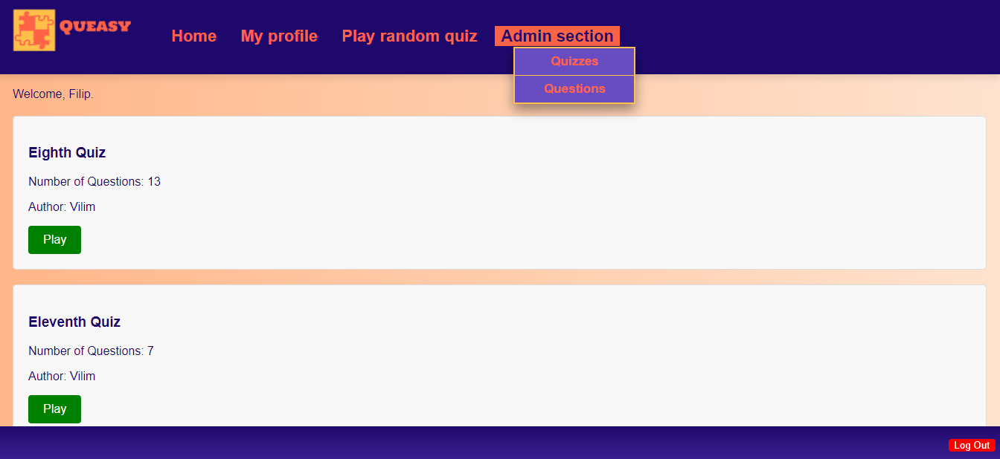

# Queasy: A Web-Based Quiz Application

**Queasy** is a PHP-based web application developed as part of the "Computer Lab II" university course. The application involves both client-side and server-side aspects of web programming, following the **MVC pattern**. It provides a user-friendly interface for solving interactive quizzes, managing quizzes and questions, and tracking player performance. Built using PHP, MySQL, and JavaScript, this project allows users to explore various question types and monitor their quiz results.

## Acknowledgements

- Vilim Kinderman
- Filip Kustura

## Features

- **User Functionality**:
  - Solve quizzes consisting of various types of questions (e.g., multiple choice, short answer).
  - Users can view quizzes available to them and track their progress.
  - Players can take quizzes, view results, and see statistics for questions and quiz categories.
  
- **Admin Functionality**:
  - Admins can create new quizzes, add questions, and define correct answers.
  - Admins can manage (edit, delete) quizzes and questions.
  - Admins have the ability to manage users and monitor their statistics.

- **Database Integration**:
  - Utilizes a MySQL database to store user data, quizzes, questions, answers, and statistics.
  - Features prepared statements for secure interaction with the database.

- **MVC Architecture**:
  - The application follows the MVC (Model-View-Controller) pattern to ensure clean separation of concerns.

## Application Structure

- **Home Page**: After logging in, users are directed to the homepage where they can view available quizzes and select the quiz to take.
- **Quiz Pages**: After selecting a quiz, the user can view the questions and answer them. Questions can be of different types: multiple choice, text input, etc.
- **Admin Panel**: Admins have access to an admin panel where they can create, edit, and delete quizzes and questions.

## Technologies Used

- **PHP:** The backend is built using PHP for server-side logic and database interactions.
- **HTML, CSS, JavaScript:** The frontend is developed using these core web technologies to create the user interface.
- **MySQL:** The application uses MySQL to store quiz data, user information, and results.
- **MVC architecture:** The application is built using the MVC architecture for better organization and maintainability.

## How to Use

1. **Log In**: 
   - Users log in with their username and password.

2. **Take a Quiz**:
   - Select a quiz from the list, solve questions, and submit your answers.
   - View your results and statistics after completing a quiz.

3. **Admin Actions**:
   - Admins can manage quizzes, questions, and users from the admin panel.
   - Admins can also track user statistics.

## Future Improvements

- **Mobile Responsiveness**: Enhance the layout to make the application fully responsive.
- **Enhanced User Profile**: Allow users to customize their profiles and track performance history.

## License

This project is for educational purposes and is not associated with any formal licensing.
